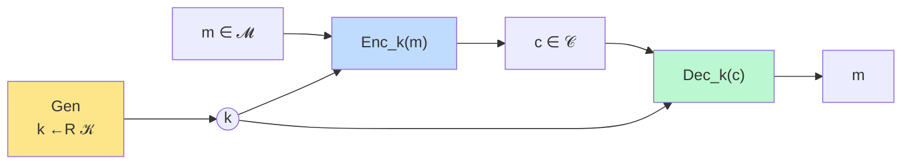
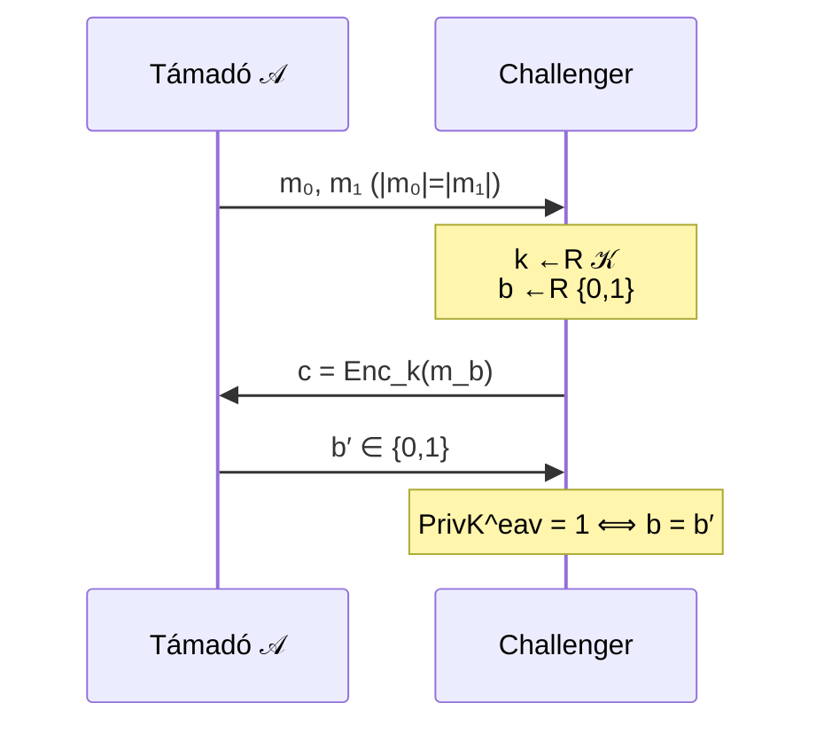

# Tökéletes biztonság

Egy titkosítási séma tökéletesen biztonságos, ha a titkosított szöveg egyáltalán nem árul el semmit az üzenetről — még korlátlan számítási kapacitású támadóval szemben sem.

## Titkosítási séma formálisan

$(Gen, Enc, Dec)$ hármas:
- $Gen$: kulcsgenerálás, $k \leftarrow_R \mathcal{K}$
- $Enc$: $c := Enc_k(m)$, ahol $k \in \mathcal{K}$, $m \in \mathcal{M}$
- $Dec$: $Dec_k(c) \in \mathcal{M}$

## Tökéletes biztonság definíciója

Egy séma **tökéletesen biztonságos** $\mathcal{M}$ felett, ha $\forall \mathcal{M}$ feletti eloszlásra, $\forall m \in \mathcal{M}$, $\forall c \in \mathcal{C}$:

$$\Pr[M = m] = \Pr[M = m \mid C = c]$$

**Informálisan:** a titkos szöveg ismeretében ne lehessen semmit sem megtudni az üzenetről.

## Lehallgatásos megkülönböztethetetlenségi kísérlet

$\mathit{PrivK}^{\mathrm{eav}}_{\mathcal{A}, \Pi}$:
1. $\mathcal{A}$ (támadó) kiad $m_0, m_1$ üzeneteket, ahol $|m_0| = |m_1|$.
2. Challenger: $k \leftarrow_R \mathcal{K}$, $b \leftarrow_R \{0,1\}$, elküldi $c = Enc_k(m_b)$.
3. $\mathcal{A}$ ismeretében kiad $b' \in \{0,1\}$.
4. $\mathit{PrivK}^{\mathrm{eav}} = 1$, ha $b = b'$.

Séma tökéletesen biztonságos $\Leftrightarrow$ bármely $\mathcal{A}$ legfeljebb $1/2$ valószínűséggel nyer.

## One-Time Pad (OTP)

Az OTP tökéletesen biztonságos:

$$c = m \oplus k, \quad m,k,c \in \{0,1\}^n$$

- Tetszőleges $m$-hez és $c$-hez létezik pontosan egy $k$, hogy $m \oplus k = c$.
- **Korlát:** a kulcsot csak egyszer szabad használni; $|k| \geq |m|$.

**Példa:** $m_0 = 101$, $m_1 = 011$, $c = 110$. A kulcs lehet $011$ és $101$ is → $\mathcal{A}$ nem tudhat jobbat, mint tippelni.

## Eltolásos rejtjel nem tökéletes (2+ karakterre)

Ha $c = ad$, akkor az üzenet két karakterének távolsága megismerhető ($d - a = 3$) → nem tökéletes $\geq 2$ karakterű szövegekre.

## Kulcstér mérete (szükséges feltétel)

**Tétel:** tökéletesen biztonságos séma esetén $|\mathcal{K}| \geq |\mathcal{M}|$.

## Shannon-tétel (szükséges és elégséges)

Legyen $(Gen, Enc, Dec)$ egy $\mathcal{M}$ feletti séma, ahol $|\mathcal{M}| = |\mathcal{K}| = |\mathcal{C}|$. Akkor és csak akkor tökéletesen titkos, ha:

1. $Gen$ minden $k \in \mathcal{K}$-t egyenlő ($1/|\mathcal{K}|$) eséllyel választ.
2. Minden $m \in \mathcal{M}$ és $c \in \mathcal{C}$-hez létezik pontosan egy $k$, hogy $Enc_k(m) = c$.

**Következmény:** az eltolásos rejtjel 1 karakterre tökéletesen biztonságos ($|\mathcal{M}| = |\mathcal{K}| = |\mathcal{C}| = 26$, $k = c - m \bmod 26$ egyértelműen meghatározott).

## Támadásmodellek és a tökéletes biztonság

- **COA:** a tökéletesen biztonságos séma definíciószerűen ellenáll.
- **KPA:** egyetlen $(p, c)$ pár ismeretével az eltolás triviálisan visszafejthető ($k = c - p \bmod 26$) — az eltolás KPA ellen nem biztonságos, bár COA ellen (1 karakter esetén) tökéletes.
- **CPA:** az Enigma CPA-val törve volt (gardening módszer).
- **CCA:** erősebb a CPA-nál.

```mermaid
flowchart TD
    COA["COA<br/>csak c"] --> KPA["KPA<br/>ismert (p,c) párok"]
    KPA --> CPA["CPA<br/>választott p → c orákulum"]
    CPA --> CCA["CCA<br/>Enc + Dec orákulum"]
    TB["Tökéletes biztonság<br/>(definíció szerint COA ellen)"] -.ellenáll.-> COA
    EL["Eltolás 1 karakter"] -.tökéletes.-> COA
    EL -.törhető.-> KPA
    style TB fill:#bbf7d0
    style CCA fill:#fecaca
```

## Feladatok

- [[concepts/kript/feladatok]] — beadandó 2. feladatsor: tökéletes biztonság bizonyítások, OTP-módosítás, Shannon-tétel alkalmazás, nómenklatúra-titkosítás oracle-lel

## Kapocs

- [[concepts/kript/tortenelmi-titkositok]] — klasszikus titkosítók és COA/KPA kontextus
- [[concepts/kript/veletlenek]] — OTP-hez szükséges valódi véletlenség
- [[subjects/kript]] — tantárgy áttekintő
