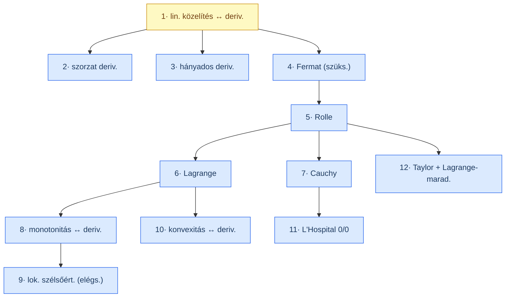
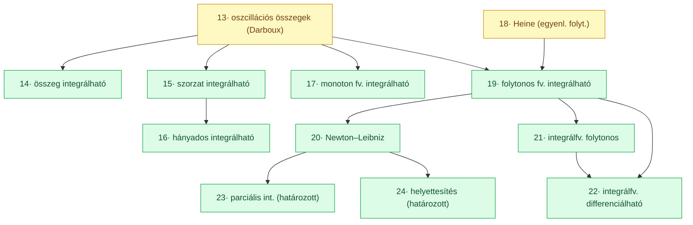
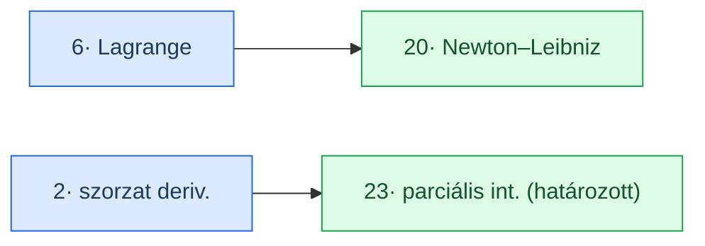

# Analízis II — Opus válaszbank + tételindex

Egyesített dokumentum. Két rész minden kategórián belül:
- **Válaszbank** — a 95 vizsgakérdés teljes kérdésszöveggel és önmagában elégséges válasszal (minden előfeltétel kimondva).
- **Bizonyítós tételek** — a vizsgán bizonyítással kért 24 tétel, csak cím + wiki-link, kategóriák szerint rendezve.

Jelölések: $K_r(a) := (a-r, a+r)$ az $a$ pont $r$ sugarú környezete; $\operatorname{int} H$ a $H$ halmaz belseje; $D\{a\}$, $C\{a\}$ az $a$-ban deriválható, ill. folytonos függvények osztálya; $R[a,b]$ a Riemann-integrálható függvények osztálya.

---

# Derivált

## Válaszbank

### Alapfogalmak (1–7)

**1. Belső pont fogalma.**
Legyen $H \subseteq \mathbb{R}$. Az $a \in \mathbb{R}$ pont a $H$ halmaz **belső pontja**, ha van olyan $r > 0$ sugár, amelyre a teljes $K_r(a) = (a-r, a+r)$ környezet $H$-ba esik:
$$a \in \operatorname{int} H \iff \exists r > 0 : (a-r,\, a+r) \subseteq H.$$
A belső pontok halmaza a $\operatorname{int} H$ (a $H$ belseje). A pontbeli derivált csak belső pontban értelmezhető, mert mindkét irányból közelíteni kell tudni $a$-hoz.

**2. Különbségihányados-függvény.**
Legyen $f \in \mathbb{R} \to \mathbb{R}$ és $a \in \operatorname{int} \mathcal{D}_f$. Az $f$ függvény $a$ ponthoz tartozó **különbségihányados-függvénye**:
$$\triangle_a f(x) := \frac{f(x) - f(a)}{x - a} \qquad (x \in \mathcal{D}_f \setminus \{a\}).$$
Geometriailag $\triangle_a f(x)$ az $(a, f(a))$ és $(x, f(x))$ pontokon átmenő **szekáns meredeksége**. A pontbeli derivált ennek a $x \to a$ határértéke: $f'(a) = \lim_{x \to a} \triangle_a f(x)$.

**3. Pontbeli differenciálhatóság.**
Legyen $f \in \mathbb{R} \to \mathbb{R}$ és $a \in \operatorname{int} \mathcal{D}_f$. Az $f$ függvény az $a$ pontban **differenciálható** (deriválható), jelölésben $f \in D\{a\}$, ha **létezik és véges** a
$$\lim_{h \to 0} \frac{f(a+h) - f(a)}{h}$$
határérték. Ezt a (szükségképpen valós) értéket $f'(a)$-val jelöljük, és $f$ **pontbeli deriváltjának** (differenciálhányadosának) nevezzük. Ekvivalens alak: $f'(a) = \lim_{x \to a} \frac{f(x)-f(a)}{x-a} \in \mathbb{R}$. (A határérték $0/0$ típusú, ezért lényeges, hogy $a$ belső pont legyen.)
→ [[concepts/analii/derivalt-fogalma]]

**4. Differenciálhatóság ↔ folytonosság.**
**Tétel.** Ha $f \in \mathbb{R} \to \mathbb{R}$, $a \in \operatorname{int} \mathcal{D}_f$ és $f \in D\{a\}$, akkor $f \in C\{a\}$ (vagyis a deriválhatóság erősebb tulajdonság a folytonosságnál). A megfordítás **nem igaz**.
*Bizonyítás.* $f \in C\{a\} \iff \lim_{x\to a}(f(x)-f(a)) = 0$. Mivel $a$ belső pont és $f$ deriválható:
$$\lim_{x \to a}\bigl(f(x) - f(a)\bigr) = \lim_{x \to a}\left(\frac{f(x)-f(a)}{x-a}\cdot(x-a)\right) = f'(a)\cdot 0 = 0. \qquad \blacksquare$$
→ [[concepts/analii/folytonossag-es-derivalt]]

**5. Folytonos, de nem differenciálható példa.**
Az abszolútérték-függvény $\operatorname{abs}(x) = |x|$ a $0$ pontban folytonos, de nem deriválható: a különbségihányados $\frac{|x|}{x}$ a $0$-ban balról $-1$-hez, jobbról $+1$-hez tart, így nincs (kétoldali) határértéke. Léteznek $\mathbb{R}$-en **mindenhol folytonos, de sehol sem deriválható** függvények is, pl. a Weierstrass-féle $f(x) = \sum_{n=0}^{\infty} \frac{\cos(15^n\pi x)}{2^n}$.
→ [[concepts/analii/folytonossag-es-derivalt]]

**6. Ekvivalens átfogalmazás lineáris közelítéssel.**
**Tétel.** Legyen $f \in \mathbb{R} \to \mathbb{R}$, $a \in \operatorname{int} \mathcal{D}_f$. Ekkor $f \in D\{a\}$ **pontosan akkor**, ha létezik $A \in \mathbb{R}$ és olyan $\varepsilon : \mathcal{D}_f \to \mathbb{R}$ függvény, amelyre $\lim_a \varepsilon = 0$ és
$$f(x) - f(a) = A\,(x-a) + \varepsilon(x)\,(x-a) \qquad (x \in \mathcal{D}_f),$$
és ekkor $A = f'(a)$. Tartalom: $f$ lokálisan az $\ell(x) = f(a) + f'(a)(x-a)$ affin függvénnyel közelíthető úgy, hogy a hiba $(x-a)$-nál gyorsabban tart $0$-hoz.
→ [[concepts/analii/linearkozelites]]

**7. Érintő fogalma.**
Ha $f \in D\{a\}$, akkor az $f$ grafikonjának $(a, f(a))$ pontjában húzott **érintője** az az egyenes, amelyhez a szekánsok tartanak, ha a második metszéspontot $a$-hoz húzzuk. Egyenlete
$$\ell(x) = f(a) + f'(a)\,(x-a),$$
meredeksége $f'(a)$, és átmegy az $(a, f(a))$ ponton. Az érintő pontosan akkor létezik, ha $f \in D\{a\}$; ez az $f$ legjobb elsőfokú közelítése $a$ körül.
→ [[concepts/analii/erintofuggveny]]

### Deriválási szabályok (8–13)

**8. Összeg deriváltja (linearitás).**
Ha $f, g \in D\{a\}$ és $\lambda \in \mathbb{R}$, akkor $\lambda f + g \in D\{a\}$ és
$$(\lambda f + g)'(a) = \lambda f'(a) + g'(a).$$
→ [[concepts/analii/derivalasi-szabalyok]]

**9. Szorzat deriváltja (Leibniz-szabály).**
Ha $f, g \in D\{a\}$, akkor $fg \in D\{a\}$ és
$$(fg)'(a) = f'(a)\,g(a) + f(a)\,g'(a).$$
→ [[concepts/analii/derivalasi-szabalyok]]

**10. Hányados deriváltja.**
Ha $f, g \in D\{a\}$ **és** $g(a) \neq 0$, akkor $\frac{f}{g} \in D\{a\}$ és
$$\left(\frac{f}{g}\right)'(a) = \frac{f'(a)\,g(a) - f(a)\,g'(a)}{g(a)^2}.$$
→ [[concepts/analii/derivalasi-szabalyok]]

**11. Kompozíció (láncszabály).**
Ha $g \in D\{a\}$ **és** $f \in D\{g(a)\}$, akkor $f \circ g \in D\{a\}$ és
$$(f \circ g)'(a) = f'\bigl(g(a)\bigr) \cdot g'(a).$$
→ [[concepts/analii/derivalasi-szabalyok]]

**12. Inverz függvény deriváltja.**
Ha $f$ szigorúan monoton, $f \in D\{a\}$ **és** $f'(a) \neq 0$, akkor $f^{-1} \in D\{f(a)\}$ és
$$\bigl(f^{-1}\bigr)'\bigl(f(a)\bigr) = \frac{1}{f'(a)}, \qquad \text{azaz} \qquad \bigl(f^{-1}\bigr)'(b) = \frac{1}{f'\bigl(f^{-1}(b)\bigr)}.$$
→ [[concepts/analii/derivalasi-szabalyok]]

**13. Hatványsor összegfüggvényének deriválhatósága.**
Ha az $f(x) = \sum_{n=0}^{\infty} a_n (x-x_0)^n$ hatványsor $R > 0$ konvergenciasugarú, akkor összegfüggvénye a teljes $(x_0 - R, x_0 + R)$ intervallumon deriválható, mégpedig **tagonként**:
$$f'(x) = \sum_{n=1}^{\infty} n\, a_n (x-x_0)^{n-1} \qquad (|x - x_0| < R).$$
(Indukcióval $f \in D^\infty$, és $a_n = f^{(n)}(x_0)/n!$.)
→ [[concepts/analii/derivalasi-szabalyok]]

### Egyoldali és magasabb rendű deriváltak (14–17)

**14. Jobb oldali derivált.**
Legyen $f \in \mathbb{R} \to \mathbb{R}$, $a \in \mathcal{D}_f$. Az $f$ **jobb oldali deriváltja** $a$-ban:
$$f'_+(a) := \lim_{h \to 0^+} \frac{f(a+h) - f(a)}{h},$$
ha ez a határérték létezik és véges.
→ [[concepts/analii/egyoldali-derivaltak]]

**15. Bal oldali derivált.**
$$f'_-(a) := \lim_{h \to 0^-} \frac{f(a+h) - f(a)}{h},$$
ha létezik és véges. Kapcsolat: $f \in D\{a\} \iff f'_+(a) = f'_-(a) \in \mathbb{R}$ (mindkét egyoldali derivált létezik, véges és egyenlő).
→ [[concepts/analii/egyoldali-derivaltak]]

**16. Kétszer differenciálható.**
Legyen $a \in \operatorname{int} \mathcal{D}_f$. Az $f$ **kétszer deriválható $a$-ban** ($f \in D^2\{a\}$), ha
- $\exists r > 0$, hogy $f$ deriválható a $K_r(a)$ környezet minden pontjában ($f \in D(K_r(a))$), és
- az $f'$ deriváltfüggvény deriválható $a$-ban ($f' \in D\{a\}$).

Ekkor $f''(a) := (f')'(a)$ a **második derivált**.
→ [[concepts/analii/magasabb-rendu-derivaltak]]

**17. $n$-szer differenciálható.**
Indukcióval: $f$ **$n$-szer deriválható $a \in \operatorname{int}\mathcal{D}_f$-ben** ($f \in D^n\{a\}$, $n \geq 2$), ha
- $\exists r > 0$, hogy $f \in D^{n-1}(K_r(a))$, és
- az $f^{(n-1)}$ függvény deriválható $a$-ban ($f^{(n-1)} \in D\{a\}$).

Ekkor $f^{(n)}(a) := \bigl(f^{(n-1)}\bigr)'(a)$. (Megállapodás: $f^{(0)} := f$, $f^{(1)} := f'$.)
→ [[concepts/analii/magasabb-rendu-derivaltak]]

### Középértéktételek (18–20)

**18. Rolle-féle középértéktétel.**
Legyen $a < b$. Ha $f \in C[a,b]$, $f \in D(a,b)$ **és** $f(a) = f(b)$, akkor
$$\exists\, \xi \in (a,b) : f'(\xi) = 0.$$
(Geometriailag: van vízszintes érintő.) Bizonyítás Weierstrass-tétellel + Fermat-feltétellel.
→ [[concepts/analii/kozeptertekek]]

**19. Lagrange-féle középértéktétel.**
Legyen $a < b$. Ha $f \in C[a,b]$ **és** $f \in D(a,b)$, akkor
$$\exists\, \xi \in (a,b) : f'(\xi) = \frac{f(b) - f(a)}{b - a}.$$
(Van olyan érintő, amely párhuzamos a végpontokat összekötő szelővel.) A Rolle-tétel következménye az $F(x) = f(x) - h_{a,b}(x)$ segédfüggvénnyel.
→ [[concepts/analii/kozeptertekek]]

**20. Cauchy-féle középértéktétel.**
Legyen $a < b$. Ha $f, g \in C[a,b]$, $f, g \in D(a,b)$ **és** $g'(x) \neq 0$ minden $x \in (a,b)$-re, akkor
$$\exists\, \xi \in (a,b) : \frac{f'(\xi)}{g'(\xi)} = \frac{f(b) - f(a)}{g(b) - g(a)}.$$
($g'(x) \neq 0$-ból Rolle-lal $g(a) \neq g(b)$ is következik.)
→ [[concepts/analii/kozeptertekek]]

### Lokális szélsőértékek (21–32)

**21. Lokális minimum fogalma.**
Az $f$ függvénynek a $c \in \operatorname{int}\mathcal{D}_f$ pontban **lokális minimuma** van, ha
$$\exists\,\delta > 0 : f(x) \geq f(c) \quad \forall x \in K_\delta(c) \cap \mathcal{D}_f.$$
**Szigorú** lokális minimum, ha $x \neq c$ esetén $f(x) > f(c)$ teljesül a környezetben.
→ [[concepts/analii/lokalis-szelsertekek]]

**22. Lokális maximum fogalma.**
A $c$ pontban **lokális maximuma** van $f$-nek, ha $\exists\,\delta > 0 : f(x) \leq f(c)$ minden $x \in K_\delta(c) \cap \mathcal{D}_f$-re. **Szigorú**, ha $x \neq c$ esetén $f(x) < f(c)$.
→ [[concepts/analii/lokalis-szelsertekek]]

**23. Elsőrendű szükséges feltétel (Fermat).**
Ha $f \in D\{a\}$ **és** $f$-nek $a$-ban lokális szélsőértéke van, akkor $f'(a) = 0$. A feltétel csak szükséges: lásd a 24. kérdést.
→ [[concepts/analii/lokalis-szelsertekek]]

**24. Példa: $f'(a) = 0$, de nincs szélsőérték.**
$f(x) = x^3$ esetén $f'(0) = 0$, de $a = 0$ **nem** szélsőérték (a függvény szigorúan nő $\mathbb{R}$-en). Tehát a Fermat-feltétel nem elégséges.
→ [[concepts/analii/lokalis-szelsertekek]]

**25. Monoton növekedés szükséges és elégséges feltétele.**
Legyen $(a,b)$ nyílt intervallum és $f \in D(a,b)$. Ekkor
$$f \nearrow (a,b)\text{-n} \iff f' \geq 0 \text{ az } (a,b)\text{-n.}$$
(A $(\Leftarrow)$ irány a Lagrange-középértéktétel következménye.)
→ [[concepts/analii/monotonitas]]

**26. Szigorú monoton növekedés elégséges feltétele.**
Legyen $(a,b)$ nyílt intervallum, $f \in D(a,b)$. Ha
$$f' > 0 \text{ az } (a,b)\text{-n}, \quad \text{akkor} \quad f \uparrow (a,b)\text{-n (szigorúan nő).}$$
Ez **csak elégséges**, nem szükséges (pl. $x^3$, $f'(0) = 0$).
→ [[concepts/analii/monotonitas]]

**27. Szigorú monoton növekedés szükséges és elégséges feltétele.**
Legyen $(a,b)$ nyílt, $f \in D(a,b)$. Ekkor
$$f \uparrow (a,b)\text{-n} \iff f' \geq 0 \text{ az } (a,b)\text{-n, és } (a,b)\text{-nek nincs olyan részintervalluma, amelyen } f' \equiv 0.$$
→ [[concepts/analii/monotonitas]]

**28. Jelet vált (előjelváltás) fogalma.**
A $h$ függvénynek a $c \in \operatorname{int}\mathcal{D}_h$ pontban **$(-,+)$ előjelváltása van**, ha $h(c) = 0$ és $\exists\,\delta > 0$:
$$h(x) < 0 \text{ ha } x \in (c-\delta, c), \qquad h(x) > 0 \text{ ha } x \in (c, c+\delta).$$
A $(+,-)$ előjelváltás hasonlóan. $h$ **előjelet vált $c$-ben**, ha van $(-,+)$ vagy $(+,-)$ előjelváltása.
→ [[concepts/analii/lokalis-szelsertekek]]

**29. Lokális minimum elsőrendű elégséges feltétele.**
Legyen $f : (a,b) \to \mathbb{R}$, $f \in D(a,b)$, $c \in (a,b)$, $f'(c) = 0$. Ha az $f'$ deriváltfüggvénynek $c$-ben **$(-,+)$ előjelváltása** van, akkor $c$ az $f$ szigorú lokális **minimumhelye**. (Mivel ekkor $f$ a $c$ előtt csökken, utána nő.)
→ [[concepts/analii/lokalis-szelsertekek]]

**30. Lokális maximum elsőrendű elégséges feltétele.**
Ugyanazon feltételek mellett, ha $f'$-nek $c$-ben **$(+,-)$ előjelváltása** van, akkor $c$ szigorú lokális **maximumhely**.
→ [[concepts/analii/lokalis-szelsertekek]]

**31. Lokális minimum másodrendű elégséges feltétele.**
Legyen $f \in D^2\{c\}$, $f'(c) = 0$ és $f''(c) > 0$. Ekkor $c$ az $f$ szigorú lokális **minimumhelye**. (Indok: $f''(c) > 0 \Rightarrow f'$-nek $(-,+)$ előjelváltása van $c$-ben.) **Nem szükséges** feltétel (pl. $x^4$, ahol $f''(0)=0$).
→ [[concepts/analii/lokalis-szelsertekek]]

**32. Lokális maximum másodrendű elégséges feltétele.**
$f \in D^2\{c\}$, $f'(c) = 0$, $f''(c) < 0$ $\Rightarrow$ $c$ szigorú lokális **maximumhely**.
→ [[concepts/analii/lokalis-szelsertekek]]

### Konvexitás, inflexió (33–41)

**33. Konvex függvény definíciója.**
Az $f : I \to \mathbb{R}$ függvény **konvex** az $I$ intervallumon, ha bármely $a, b \in I$, $a < b$ esetén a grafikon a húr alatt halad:
$$f(x) \leq \frac{f(b)-f(a)}{b-a}(x-a) + f(a) \qquad (\forall x \in (a,b)).$$
**Szigorúan konvex**, ha $<$ áll. Ekvivalens ($\lambda$-)alak: $f(\lambda a + (1-\lambda)b) \leq \lambda f(a) + (1-\lambda)f(b)$ minden $\lambda \in (0,1)$-re.
→ [[concepts/analii/konvex-konkav-fuggvenyek]]

**34. Konkáv függvény definíciója.**
$f$ **konkáv** $I$-n, ha a fenti egyenlőtlenségben $\geq$ áll (a grafikon a húr felett halad), **szigorúan konkáv**, ha $>$. Ekvivalensen: $f$ konkáv $\iff -f$ konvex.
→ [[concepts/analii/konvex-konkav-fuggvenyek]]

**35. Konvexitás az első deriválttal.**
Legyen $I$ nyílt intervallum, $f \in D(I)$. Ekkor
$$f \text{ konvex } I\text{-n} \iff f' \nearrow I\text{-n (monoton nő).}$$
(Szigorú konvexitásnál $f' \uparrow$.)
→ [[concepts/analii/konvex-konkav-fuggvenyek]]

**36. Konkávitás az első deriválttal.**
Legyen $I$ nyílt, $f \in D(I)$. Ekkor
$$f \text{ konkáv } I\text{-n} \iff f' \searrow I\text{-n (monoton csökken).}$$
→ [[concepts/analii/konvex-konkav-fuggvenyek]]

**37. Konvexitás a második deriválttal.**
Legyen $I$ nyílt, $f \in D^2(I)$. Ekkor
$$f \text{ konvex } I\text{-n} \iff f'' \geq 0 \text{ az } I\text{-n.}$$
Továbbá $f'' > 0 \Rightarrow f$ szigorúan konvex (de nem megfordítható).
→ [[concepts/analii/konvex-konkav-fuggvenyek]]

**38. Konkávitás a második deriválttal.**
Legyen $I$ nyílt, $f \in D^2(I)$. Ekkor
$$f \text{ konkáv } I\text{-n} \iff f'' \leq 0 \text{ az } I\text{-n}; \qquad f'' < 0 \Rightarrow \text{szigorúan konkáv.}$$
→ [[concepts/analii/konvex-konkav-fuggvenyek]]

**39. Inflexiós pont definíciója.**
Legyen $I$ nyílt, $f \in D(I)$. A $c \in I$ pont $f$ **inflexiós pontja**, ha
$$\exists\,\delta > 0 : f \text{ konvex } (c-\delta, c]\text{-n és konkáv } [c, c+\delta)\text{-n, vagy fordítva.}$$
(Itt fordul át a konvexitás iránya. Pl. $x^3$-nek $c = 0$ inflexiós pontja.) Szükséges feltétel $f \in D^2$ esetén: $f''(c) = 0$; elégséges: $f''$ előjelet vált $c$-ben.
→ [[concepts/analii/inflexios-pont]]

**40. Konvexitás és az érintő kapcsolata.**
Legyen $I$ nyílt, $f \in D(I)$. Ekkor
$$f \text{ konvex } I\text{-n} \iff \forall a \in I : f(x) \geq e_{f,a}(x) \;\; (x \in I),$$
ahol $e_{f,a}(x) = f(a) + f'(a)(x-a)$ az $a$-beli érintő. Vagyis a konvex függvény grafikonja **minden érintője felett** halad.
→ [[concepts/analii/konvex-konkav-fuggvenyek]]

**41. Konkávitás és az érintő kapcsolata.**
Legyen $I$ nyílt, $f \in D(I)$. Ekkor
$$f \text{ konkáv } I\text{-n} \iff \forall a \in I : f(x) \leq e_{f,a}(x) \;\; (x \in I),$$
azaz a konkáv függvény grafikonja **minden érintője alatt** halad.
→ [[concepts/analii/konvex-konkav-fuggvenyek]]

### L'Hospital és Taylor (42–47)

**42. L'Hospital-szabály $\frac{0}{0}$ esetre.**
Legyen $-\infty \leq a < b \leq +\infty$, $f, g \in D(a,b)$. Tegyük fel, hogy
(a) $\lim_{a+0} f = \lim_{a+0} g = 0$,
(b) $g(x) \neq 0$ és $g'(x) \neq 0$ minden $x \in (a,b)$-re,
(c) $\exists \lim_{a+0} \frac{f'}{g'} \in \overline{\mathbb{R}}$.
Ekkor létezik $\lim_{a+0} \frac{f}{g}$, és
$$\lim_{a+0} \frac{f}{g} = \lim_{a+0} \frac{f'}{g'}.$$
(Bizonyítás a Cauchy-féle középértéktétellel.) Hasonló állítás bal-/kétoldali és $+\infty$-beli határértékre.
→ [[concepts/analii/lhospital-szabalyok]]

**43. L'Hospital-szabály $\frac{+\infty}{+\infty}$ esetre.**
Ugyanazon $f, g \in D(a,b)$ keretben, ha
(a) $\lim_{a+0} f = \lim_{a+0} g = +\infty$,
(b) $g(x) \neq 0$, $g'(x) \neq 0$ az $(a,b)$-n,
(c) $\exists \lim_{a+0} \frac{f'}{g'} \in \overline{\mathbb{R}}$,
akkor $\lim_{a+0} \frac{f}{g} = \lim_{a+0} \frac{f'}{g'}$. (A $\frac{\pm\infty}{\pm\infty}$ változatok analógak.)
→ [[concepts/analii/lhospital-szabalyok]]

**44. Hatványsor összegfüggvénye és együtthatói kapcsolata.**
Ha $f(x) = \sum_{n=0}^{\infty} \alpha_n (x-a)^n$ konvergenciasugara $R > 0$, akkor $f \in D^\infty$ a $K_R(a)$-n, és tagonkénti deriválás után $x = a$ helyettesítéssel az együtthatók egyértelműen kifejeződnek:
$$\alpha_n = \frac{f^{(n)}(a)}{n!} \qquad (n \in \mathbb{N}).$$
Tehát egy konvergens hatványsor együtthatóit az összegfüggvény deriváltjai határozzák meg.
→ [[concepts/analii/taylor-polinom]]

**45. Taylor-sor definíciója.**
Legyen $f \in D^\infty\{a\}$ ($a \in \operatorname{int}\mathcal{D}_f$). Az $f$ függvény $a$ ponthoz tartozó **Taylor-sora**:
$$T_a f(x) := \sum_{k=0}^{\infty} \frac{f^{(k)}(a)}{k!}(x-a)^k.$$
Az $n$-edik **Taylor-polinom**: $T_{a,n} f(x) = \sum_{k=0}^{n} \frac{f^{(k)}(a)}{k!}(x-a)^k$. Az $a = 0$ esetet **Maclaurin-sornak** nevezzük.
→ [[concepts/analii/taylor-polinom]]

**46. Taylor-formula Lagrange-féle maradéktaggal.**
Legyen $n \in \mathbb{N}$ és $f \in D^{n+1}(K(a))$. Ekkor minden $x \in K(a)$-hoz létezik $a$ és $x$ közé eső $\xi$, hogy
$$f(x) = \sum_{k=0}^{n} \frac{f^{(k)}(a)}{k!}(x-a)^k + \underbrace{\frac{f^{(n+1)}(\xi)}{(n+1)!}(x-a)^{n+1}}_{\text{Lagrange-maradéktag}}.$$
(Bizonyítás a Cauchy-féle középértéktétel ismételt alkalmazásával.)
→ [[concepts/analii/taylor-formula-maradektag]]

**47. Elégséges feltétel a Taylor-sor konvergenciájára (előállítás).**
Legyen $f \in D^\infty(K(a))$. Ha a deriváltak **egyenletesen korlátosak**, azaz
$$\exists M > 0 : |f^{(n)}(x)| \leq M \quad (\forall x \in K(a),\ \forall n \in \mathbb{N}),$$
akkor a Taylor-sor a $K(a)$-n **előállítja** $f$-et: $f(x) = \sum_{k=0}^{\infty} \frac{f^{(k)}(a)}{k!}(x-a)^k$. (Indok: a Lagrange-maradéktag $\leq M\frac{|x-a|^{n+1}}{(n+1)!} \to 0$.)
→ [[concepts/analii/taylor-sor-eloallitas]], [[concepts/analii/taylor-formula-maradektag]]

## Bizonyítós tételek — Differenciálszámítás

| #   | Tétel                                                              | Wiki                                                                     |
| --- | ------------------------------------------------------------------ | ------------------------------------------------------------------------ |
| 1   | A deriválhatóság ekvivalens átfogalmazása lineáris közelítéssel    | [[concepts/analii/linearkozelites\|linearkozelites]]                     |
| 2   | A szorzatfüggvény deriválása                                       | [[concepts/analii/derivalasi-szabalyok\|derivalasi-szabalyok]]           |
| 3   | A hányadosfüggvény deriválása                                      | [[concepts/analii/derivalasi-szabalyok\|derivalasi-szabalyok]]           |
| 4   | A lokális szélsőértékre vonatkozó elsőrendű szükséges feltétel     | [[concepts/analii/lokalis-szelsertekek\|lokalis-szelsertekek]]           |
| 5   | A Rolle-féle középértéktétel                                       | [[concepts/analii/kozeptertekek\|kozeptertekek]]                         |
| 6   | A Lagrange-féle középértéktétel                                    | [[concepts/analii/kozeptertekek\|kozeptertekek]]                         |
| 7   | A Cauchy-féle középértéktétel                                      | [[concepts/analii/kozeptertekek\|kozeptertekek]]                         |
| 8   | Monotonitás és a derivált kapcsolata (nyílt int., deriválható fv.) | [[concepts/analii/monotonitas\|monotonitas]]                             |
| 9   | A lokális szélsőértékre vonatkozó elsőrendű elégséges feltétel     | [[concepts/analii/lokalis-szelsertekek\|lokalis-szelsertekek]]           |
| 10  | A konvexitás jellemzése a deriváltfüggvénnyel                      | [[concepts/analii/konvex-konkav-fuggvenyek\|konvex-konkav-fuggvenyek]]   |
| 11  | A  0/0 határérték L'Hospital-szabálya                              | [[concepts/analii/lhospital-szabalyok\|lhospital-szabalyok]]             |
| 12  | A Taylor-formula a Lagrange-féle maradéktaggal                     | [[concepts/analii/taylor-formula-maradektag\|taylor-formula-maradektag]] |
 
### Bizonyítási függőségi gráf — differenciálszámítás

Élek: A → B = „A tételt használjuk B bizonyításában". Gyökér (sárga): 1 — nincs előfeltétel.

---

# Integrált

## Válaszbank

### Határozatlan integrál / primitív függvény (48–56)

**48. Primitív függvény definíciója.**
Legyen $I \subseteq \mathbb{R}$ nyílt intervallum és $f : I \to \mathbb{R}$. Az $F : I \to \mathbb{R}$ függvény az $f$ **primitív függvénye**, ha
$$F \in D(I) \quad \text{és} \quad F'(x) = f(x) \quad (\forall x \in I).$$
Két primitív függvény egy konstansban különbözik (a deriváltak egyenlőségének tétele alapján, mivel $I$ intervallum).
→ [[concepts/analii/primitiv-fuggveny]]

**49. Nincs primitív függvénye — példa.**
Az ugrásfüggvény
$$f(x) = \begin{cases} 0, & x \leq 0 \\ 1, & x > 0 \end{cases}$$
nem rendelkezik primitív függvénnyel $\mathbb{R}$-en: egy feltételezett $F$ esetén $F'_-(0) = 0 \neq 1 = F'_+(0)$, tehát $F \notin D\{0\}$. (Általában: ugró szakadásnál nincs primitív függvény, mert hiányzik a Darboux-tulajdonság.)
→ [[concepts/analii/primitiv-fuggveny]]

**50. Primitív függvény létezése — szükséges feltétel (Darboux).**
Ha $f$-nek van primitív függvénye az $I$ intervallumon, akkor $f$ **Darboux-tulajdonságú**: bármely $a, b \in I$, $a < b$ és bármely $f(a)$, $f(b)$ közé eső $c$ értékhez van olyan $\xi \in [a,b]$, hogy $f(\xi) = c$ (vagyis $f$ nem ugorhat át értékeket). Ez **szükséges**, de nem elégséges feltétel.
→ [[concepts/analii/primitiv-fuggveny]]

**51. Primitív függvény létezése — elégséges feltétel (folytonosság).**
Ha $f$ **folytonos** az $I$ intervallumon, akkor van primitív függvénye $I$-n. (Ez a Newton–Leibniz-tételből / az integrálfüggvény deriválhatóságából következik: az $F(x) = \int_{x_0}^x f$ integrálfüggvény primitív függvény.) A folytonosság elégséges, de nem szükséges.
→ [[concepts/analii/primitiv-fuggveny]]

**52. Határozatlan integrál jelentése.**
Az $I$ nyílt intervallumon értelmezett $f$ függvény **határozatlan integrálja** az összes primitív függvényének halmaza:
$$\int f := \{F : I \to \mathbb{R} \mid F \in D(I),\ F' = f\}.$$
Ha $F$ egy primitív függvény, akkor $\int f = \{F + c \mid c \in \mathbb{R}\}$, röviden $\int f(x)\,dx = F(x) + c$.
→ [[concepts/analii/hatarozatlan-integral]]

**53. Határozatlan integrál linearitása.**
Ha $f, g : I \to \mathbb{R}$-nek van primitív függvénye és $\alpha, \beta \in \mathbb{R}$, akkor $\alpha f + \beta g$-nek is van, és
$$\int \bigl(\alpha f(x) + \beta g(x)\bigr)\,dx = \alpha \int f(x)\,dx + \beta \int g(x)\,dx.$$
→ [[concepts/analii/hatarozatlan-integral]]

**54. Parciális integrálás tétele.**
Legyen $I$ nyílt intervallum. Ha $f, g \in D(I)$ és az $f'g$ függvénynek van primitív függvénye $I$-n, akkor $fg'$-nek is van, és
$$\int f(x) g'(x)\,dx = f(x)g(x) - \int f'(x) g(x)\,dx.$$
(A szorzatszabály megfordítása; akkor hasznos, ha $\int f'g$ ismert.)
→ [[concepts/analii/hatarozatlan-integral]]

**55. Első helyettesítési szabály.**
Legyenek $I, J$ nyílt intervallumok, $g : I \to \mathbb{R}$, $f : J \to \mathbb{R}$. Ha $g \in D(I)$, $\mathcal{R}_g \subseteq J$ és $f$-nek van primitív függvénye ($F \in \int f$), akkor $(f \circ g)\cdot g'$-nek is van, és
$$\int f\bigl(g(x)\bigr)\,g'(x)\,dx = F\bigl(g(x)\bigr) + c \qquad (x \in I).$$
(A láncszabály megfordítása.)
→ [[concepts/analii/hatarozatlan-integral]]

**56. Második helyettesítési szabály.**
Legyenek $I, J$ nyílt intervallumok, $f : I \to \mathbb{R}$ és $g : J \to I$ **bijekció**, $g \in D(J)$, $g'(x) \neq 0$ minden $x \in J$-re, és $(f \circ g)\cdot g'$-nek van primitív függvénye $J$-n. Ekkor $f$-nek is van, és
$$\int f(x)\,dx = \left.\int f\bigl(g(t)\bigr)\,g'(t)\,dt\right|_{t = g^{-1}(x)} \qquad (x \in I).$$
($g'(x) \neq 0 \Rightarrow g$ szigorúan monoton, így invertálható.)
→ [[concepts/analii/hatarozatlan-integral]]

### Határozott integrál — felosztás, Darboux, Riemann (57–71)

A továbbiakban $[a,b]$ korlátos és zárt intervallum ($a < b$), $K[a,b]$ az $[a,b]$-n korlátos függvények osztálya, $\mathcal{F}[a,b]$ a felosztások halmaza.

**57. Intervallum felosztása.**
Az $[a,b]$ egy **felosztása** egy véges, szigorúan növő pontsorozat:
$$\tau = \{a = x_0 < x_1 < \cdots < x_n = b\}, \quad n \in \mathbb{N}^+.$$
**Finomsága**: $\|\tau\| := \max\{x_i - x_{i-1} \mid i = 1,\dots,n\}$.
→ [[concepts/analii/hatarozott-integral-ertelmezese]]

**58. Felosztás finomítása.**
A $\tau_2$ felosztás a $\tau_1$ **finomítása**, ha $\tau_1 \subseteq \tau_2$ (azaz $\tau_2$ tartalmazza $\tau_1$ minden osztópontját, és esetleg továbbiakat is). Két felosztás közös finomítása $\tau_1 \cup \tau_2$.
→ [[concepts/analii/hatarozott-integral-ertelmezese]]

**59. Alsó közelítő összeg definíciója.**
Legyen $f \in K[a,b]$, $\tau \in \mathcal{F}[a,b]$, $m_i := \inf_{[x_{i-1}, x_i]} f$. Az **alsó közelítő összeg**:
$$s(f, \tau) := \sum_{i=1}^{n} m_i\,(x_i - x_{i-1}).$$
($f \geq 0$ esetén a beírt téglalapok területösszege. Az $m_i$ véges, mert $f$ korlátos.)
→ [[concepts/analii/hatarozott-integral-ertelmezese]]

**60. Felső közelítő összeg definíciója.**
$M_i := \sup_{[x_{i-1}, x_i]} f$ mellett a **felső közelítő összeg**:
$$S(f, \tau) := \sum_{i=1}^{n} M_i\,(x_i - x_{i-1}).$$
($f \geq 0$ esetén a körülírt téglalapok területösszege.)
→ [[concepts/analii/hatarozott-integral-ertelmezese]]

**61. Alsó összeg finomításnál.**
Ha $\tau_2$ a $\tau_1$ finomítása ($\tau_1 \subseteq \tau_2$), akkor az alsó összeg **nem csökkenhet**:
$$s(f, \tau_1) \leq s(f, \tau_2).$$
(Egy új osztópont az adott részintervallumon az inf-et csak növelheti.)
→ [[concepts/analii/hatarozott-integral-ertelmezese]]

**62. Felső összeg finomításnál.**
Ha $\tau_1 \subseteq \tau_2$, akkor a felső összeg **nem nőhet**:
$$S(f, \tau_1) \geq S(f, \tau_2).$$
→ [[concepts/analii/hatarozott-integral-ertelmezese]]

**63. Alsó és felső összeg viszonya.**
Bármely $\tau_1, \tau_2 \in \mathcal{F}[a,b]$ (akár különböző) felosztásra
$$s(f, \tau_1) \leq S(f, \tau_2).$$
(Indok: a $\tau = \tau_1 \cup \tau_2$ közös finomításra $s(f,\tau_1) \leq s(f,\tau) \leq S(f,\tau) \leq S(f,\tau_2)$.)
→ [[concepts/analii/hatarozott-integral-ertelmezese]]

**64. Darboux-féle alsó integrál.**
$$I_*(f) := \sup_{\tau \in \mathcal{F}[a,b]} s(f, \tau).$$
(Az összes alsó közelítő összeg szuprémuma; létezik és véges, mert $f$ korlátos és az alsó összegek felülről korlátosak bármely felső összeggel.)
→ [[concepts/analii/hatarozott-integral-ertelmezese]]

**65. Darboux-féle felső integrál.**
$$I^*(f) := \inf_{\tau \in \mathcal{F}[a,b]} S(f, \tau).$$
Mindig $I_*(f) \leq I^*(f)$.
→ [[concepts/analii/hatarozott-integral-ertelmezese]]

**66. Mikor (Riemann-)integrálható.**
Az $f \in K[a,b]$ függvény **Riemann-integrálható** $[a,b]$-n ($f \in R[a,b]$), ha az alsó és felső Darboux-integrál megegyezik:
$$I_*(f) = I^*(f).$$
→ [[concepts/analii/hatarozott-integral-ertelmezese]]

**67. Határozott (Riemann-)integrál értelmezése.**
Ha $f \in R[a,b]$, akkor a **határozott integrál** a közös érték:
$$\int_a^b f := \int_a^b f(x)\,dx := I_*(f) = I^*(f).$$
→ [[concepts/analii/hatarozott-integral-ertelmezese]]

**68. Nem integrálható függvény — példa.**
A **Dirichlet-függvény** $[0,1]$-en:
$$D(x) = \begin{cases} 1, & x \in \mathbb{Q} \\ 0, & x \notin \mathbb{Q} \end{cases}$$
nem integrálható, mert minden felosztásra $s(D,\tau) = 0$ és $S(D,\tau) = 1$, tehát $I_*(D) = 0 \neq 1 = I^*(D)$.
→ [[concepts/analii/integralhato-fuggvenyek]]

**69. Oszcillációs összeg definíciója.**
$$\Omega(f, \tau) := S(f, \tau) - s(f, \tau) = \sum_{i=1}^{n} (M_i - m_i)(x_i - x_{i-1}) \geq 0.$$
Azt méri, mennyire „ingadozik" $f$ az egyes részintervallumokon.
→ [[concepts/analii/integralhato-fuggvenyek]]

**70. Riemann-kritérium oszcillációs összeggel (Darboux-kritérium).**
$$f \in R[a,b] \iff \forall \varepsilon > 0\ \exists \tau \in \mathcal{F}[a,b] : \Omega(f, \tau) < \varepsilon.$$
(Vagyis az oszcilláció tetszőlegesen kicsivé tehető megfelelő felosztással.)
→ [[concepts/analii/integralhato-fuggvenyek]]

**71. Ekvivalens átfogalmazás felosztássorozatokkal.**
$$f \in R[a,b] \text{ és } \int_a^b f = I \iff \exists (\tau_n) \text{ felosztássorozat}: s(f, \tau_n) \to I \text{ és } S(f, \tau_n) \to I.$$
→ [[concepts/analii/integralhato-fuggvenyek]]

### A Riemann-integrál tulajdonságai (72–79)

**72. Összeg integrálhatósága.**
Ha $f, g \in R[a,b]$, akkor $f + g \in R[a,b]$ és
$$\int_a^b (f + g) = \int_a^b f + \int_a^b g.$$
(Az $s(f,\tau)+s(g,\tau) \leq s(f+g,\tau) \leq S(f+g,\tau) \leq S(f,\tau)+S(g,\tau)$ becslésből.)
→ [[concepts/analii/muvelet-integralhato-fuggvenyekkel]]

**73. Szorzat integrálhatósága.**
Ha $f, g \in R[a,b]$, akkor $f \cdot g \in R[a,b]$. (Bizonyítás: előbb $f, g \geq 0$-ra az oszcillációs összegekkel $\Omega(fg,\tau) \leq M(\Omega(f,\tau)+\Omega(g,\tau))$, majd az $f - \inf f \geq 0$ eltolással az általános esetre.) Megjegyzés: $\int fg$-re nincs szorzatszabály.
→ [[concepts/analii/muvelet-integralhato-fuggvenyekkel]]

**74. Hányados integrálhatósága.**
Ha $f, g \in R[a,b]$ **és** $|g(x)| \geq m > 0$ minden $x \in [a,b]$-re (azaz $g$ a nullától elszigetelt), akkor $\frac{f}{g} \in R[a,b]$. (Elég $\frac{1}{g} \in R[a,b]$: $\Omega(\frac{1}{g}, \tau) \leq \frac{1}{m^2}\Omega(g, \tau)$.)
→ [[concepts/analii/muvelet-integralhato-fuggvenyekkel]]

**75. Értékek megváltoztatása véges sok helyen.**
Ha $f \in R[a,b]$, $g \in K[a,b]$, és az $\{x : f(x) \neq g(x)\}$ halmaz **véges**, akkor $g \in R[a,b]$ és
$$\int_a^b g = \int_a^b f.$$
(A Riemann-integrál érzéketlen a véges sok pontbeli értékre.)
→ [[concepts/analii/riemann-integral-tulajdonsagok]]

**76. Intervallum szerinti additivitás.**
Legyen $a < c < b$. Ekkor $f \in R[a,b] \iff f \in R[a,c]$ és $f \in R[c,b]$, és ekkor
$$\int_a^b f = \int_a^c f + \int_c^b f.$$
(Megállapodás: $\int_a^a f := 0$ és $\int_b^a f := -\int_a^b f$, amivel a képlet tetszőleges $a, b, c$ kölcsönös helyzetére érvényes.)
→ [[concepts/analii/riemann-integral-tulajdonsagok]]

**77. Integrálszámítás első középértéktétele.**
Legyen $f, g \in R[a,b]$, $g \geq 0$, $m := \inf_{[a,b]} f$, $M := \sup_{[a,b]} f$. Ekkor
$$m \int_a^b g \leq \int_a^b f\,g \leq M \int_a^b g.$$
Ha még $f \in C[a,b]$, akkor $\exists\, \xi \in [a,b]$, hogy $\int_a^b f g = f(\xi) \int_a^b g$. Speciálisan $g \equiv 1$, $f \in C[a,b]$ esetén $\int_a^b f = f(\xi)(b-a)$ (integrálközép = $\frac{1}{b-a}\int_a^b f$).
→ [[concepts/analii/integral-egyenlotlensegek]]

**78. Cauchy–Bunyakovszkij–Schwarz-egyenlőtlenség.**
Ha $f, g \in R[a,b]$ (ekkor $f^2, g^2, fg \in R[a,b]$), akkor
$$\left(\int_a^b f\,g\right)^2 \leq \left(\int_a^b f^2\right)\left(\int_a^b g^2\right).$$
(Indok: $\int_a^b (f - \lambda g)^2 \geq 0$ minden $\lambda \in \mathbb{R}$-re; ez egy $\lambda$-ban másodfokú, nemnegatív polinom, melynek diszkriminánsa $\leq 0$ — éppen a fenti egyenlőtlenség.)
→ [[concepts/analii/integral-egyenlotlensegek]] *(a wikiben az integrálegyenlőtlenségek a legközelebbi oldal)*

**79. Monotonitás ↔ Riemann-integrálhatóság.**
Ha $f : [a,b] \to \mathbb{R}$ **monoton** $[a,b]$-n, akkor $f \in R[a,b]$. (Bizonyítás: $f \nearrow$ esetén egyenletes $\tau$ felosztásnál az oszcilláció teleszkopikus, $\Omega(f,\tau) = \frac{b-a}{n}(f(b)-f(a)) \to 0$, így a Darboux-kritérium teljesül.)
→ [[concepts/analii/monoton-fuggvenyek-integralhatasaga]]

### Folytonosság és integrálhatóság (80–84)

**80. Szakaszonként monoton függvény fogalma.**
Az $f : [a,b] \to \mathbb{R}$ függvény **szakaszonként monoton**, ha létezik olyan $\tau = \{a = x_0 < \cdots < x_m = b\}$ felosztás, hogy
1. $f$ minden $(x_{i-1}, x_i)$ nyílt részintervallumon monoton, és
2. $f$ korlátos $[a,b]$-n (ez garantálja az osztópontoknál a véges egyoldali határértékeket).

Ekkor $f \in R[a,b]$ és $\int_a^b f = \sum_{i=1}^m \int_{x_{i-1}}^{x_i} f$.
→ [[concepts/analii/monoton-fuggvenyek-integralhatasaga]]

**81. Egyenletes folytonosság definíciója.**
Az $f \in \mathbb{R} \to \mathbb{R}$ függvény **egyenletesen folytonos** a $H \subseteq \mathcal{D}_f$ halmazon, ha
$$\forall \varepsilon > 0\ \exists \delta > 0 : \forall x, y \in H,\ |x - y| < \delta \Rightarrow |f(x) - f(y)| < \varepsilon.$$
Lényeg: a $\delta$ **csak $\varepsilon$-tól függ**, a ponttól nem (szemben a pontbeli folytonossággal). Egyenletes folytonosság $\Rightarrow$ folytonosság, de fordítva általában nem.
→ [[concepts/analii/egyenletes-folytonossag]]

**82. Heine-tétel.**
Ha $-\infty < a < b < +\infty$ és $f \in C[a,b]$ (folytonos a korlátos, zárt intervallumon), akkor $f$ **egyenletesen folytonos** $[a,b]$-n. (Indirekt bizonyítás: ellenkező esetben egy korlátos sorozatból konvergens részsorozatot véve ellentmondás adódik a pontbeli folytonossággal.)
→ [[concepts/analii/egyenletes-folytonossag]]

**83. Folytonosság ↔ Riemann-integrálhatóság.**
Ha $f \in C[a,b]$ (folytonos a korlátos, zárt intervallumon), akkor $f \in R[a,b]$, azaz $C[a,b] \subseteq R[a,b]$. (Bizonyítás: Heine-tétel szerint $f$ egyenletesen folytonos, így $\|\tau\| < \delta$ esetén $M_i - m_i \leq \frac{\varepsilon}{b-a}$, amiből $\Omega(f,\tau) \leq \varepsilon$ — Darboux-kritérium.) A tartalmazás valódi (pl. a Riemann-függvény integrálható, de nem folytonos).
→ [[concepts/analii/folytonos-fuggvenyek-integralhatasaga]]

**84. Szakaszonként folytonos függvény fogalma.**
Az $f : [a,b] \to \mathbb{R}$ függvény **szakaszonként folytonos**, ha létezik olyan $\tau = \{a = x_0 < \cdots < x_m = b\}$ felosztás, hogy
1. $f$ minden $(x_{i-1}, x_i)$ nyílt részintervallumon folytonos, és
2. minden osztópontban léteznek és végesek a megfelelő egyoldali határértékek ($\lim_{x \to x_i^\pm} f$).

Minden szakaszonként folytonos függvény $R[a,b]$-beli (véges sok szakadási hely az integrálhatóságot nem rontja el).
→ [[concepts/analii/folytonos-fuggvenyek-integralhatasaga]] *(legközelebbi oldal)*

### Newton–Leibniz, integrálfüggvény (85–90)

**85. Newton–Leibniz-tétel.**
Ha $f \in R[a,b]$ **és** $f$-nek van $F$ primitív függvénye az $[a,b]$-n, akkor
$$\int_a^b f(x)\,dx = F(b) - F(a) = \bigl[F(x)\bigr]_a^b.$$
(Bizonyítás: tetszőleges $\tau$-ra a Lagrange-középértéktétellel $F(b) - F(a) = \sigma(f,\tau,\xi)$, ami $s(f,\tau)$ és $S(f,\tau)$ közé esik; $f \in R[a,b]$ miatt ez épp az integrál.) A két feltétel független; ha $f \in C[a,b]$, mindkettő teljesül.
→ [[concepts/analii/newton-leibniz-tetel]]

**86. Integrálfüggvény fogalma.**
Legyen $f \in R[a,b]$ és $x_0 \in [a,b]$. Az
$$F : [a,b] \ni x \mapsto \int_{x_0}^x f(t)\,dt$$
függvény az $f$ **$x_0$-ban eltűnő integrálfüggvénye** (mert $F(x_0) = 0$).
→ [[concepts/analii/integralfuggveny]]

**87. Integrálfüggvény folytonossága.**
Ha $f \in R[a,b]$, akkor az $F(x) = \int_{x_0}^x f$ integrálfüggvény **folytonos** (sőt egyenletesen folytonos) $[a,b]$-n. (Indok: $|F(y) - F(x)| = |\int_x^y f| \leq M|y - x|$, ahol $M$ az $f$ korlátja — $f$ tetszőleges integrálható esetén is, folytonosság nélkül.)
→ [[concepts/analii/integralfuggveny]]

**88. Integrálfüggvény deriválhatósága.**
Ha $f \in R[a,b]$ és $f$ **folytonos** egy $d \in [a,b]$ pontban, akkor $F(x) = \int_{x_0}^x f$ deriválható $d$-ben, és
$$F'(d) = f(d).$$
Következmény: ha $f \in C[a,b]$, akkor $F \in D[a,b]$, $F' = f$, vagyis $F$ az $f$ primitív függvénye (ez a NL-tétel elégséges feltétele).
→ [[concepts/analii/integralfuggveny]]

**89. Parciális integrálás határozott integrálra.**
Ha $f, g \in D[a,b]$ és $f', g' \in R[a,b]$, akkor
$$\int_a^b f\,g' = \bigl[f g\bigr]_a^b - \int_a^b f'\,g = f(b)g(b) - f(a)g(a) - \int_a^b f'\,g.$$
(Bizonyítás: $fg$ primitív függvénye $f'g + fg'$-nek, alkalmazva a Newton–Leibniz-tételt.)
→ [[concepts/analii/hatarozott-integral-parcialisintegrals]]

**90. Helyettesítéses integrálás határozott integrálra.**
Ha $f \in C[a,b]$ és $g : [\alpha, \beta] \to [a,b]$ folytonosan deriválható ($g \in C^1$), akkor
$$\int_{g(\alpha)}^{g(\beta)} f = \int_\alpha^\beta (f \circ g)\cdot g'.$$
Lényeges különbség a határozatlan esethez: a **határokat is transzformáljuk** ($g(\alpha) \to g(\beta)$), és nincs visszahelyettesítés.
→ [[concepts/analii/hatarozott-integral-helyettesites]]

### Ívhossz és improprius integrál (91–95)

**91. Rektifikálható grafikon.**
Legyen $a < b$, $f : [a,b] \to \mathbb{R}$, és $\Gamma_f = \{(x, f(x)) : x \in [a,b]\}$ a grafikon. A $\tau$ felosztáshoz tartozó beírt töröttvonal hossza $\ell_f(\tau) = \sum_{i=1}^n \sqrt{(x_i - x_{i-1})^2 + (f(x_i) - f(x_{i-1}))^2}$. A $\Gamma_f$ grafikon **rektifikálható**, ha
$$\ell(\Gamma_f) := \sup\{\ell_f(\tau) \mid \tau \in \mathcal{F}[a,b]\} < +\infty,$$
és ekkor $\ell(\Gamma_f)$ a grafikon **ívhossza**.
→ [[concepts/analii/ivhossz]]

**92. $C^1$ grafikon ívhossza.**
Ha $f \in C^1[a,b]$ (folytonosan deriválható: $f \in D[a,b]$ és $f' \in C[a,b]$, a végpontokban egyoldali deriválttal), akkor $\Gamma_f$ rektifikálható, és
$$\ell(\Gamma_f) = \int_a^b \sqrt{1 + \bigl[f'(x)\bigr]^2}\,dx < +\infty.$$
(Bizonyítás: a Lagrange-középértéktétellel $\ell_f(\tau)$ a $g = \sqrt{1 + (f')^2}$ folytonos függvény Riemann-féle közelítő összege.)
→ [[concepts/analii/ivhossz]]

**93. $\int_0^{+\infty} f$ improprius integrál.**
Legyen $f : [0, +\infty) \to \mathbb{R}$ olyan, hogy $f \in R[0, t]$ minden $t > 0$-ra. Az $\int_0^{+\infty} f$ improprius integrál **konvergens** és értéke $I$, ha
$$\lim_{t \to +\infty} \int_0^t f(x)\,dx = I \in \mathbb{R} \text{ (létezik és véges).}$$
(Ha a határérték $\pm\infty$, az integrál létezik, de divergens.)
→ [[concepts/analii/improprius-integral]]

**94. $\int_a^b f$ improprius, $f : [a, b) \to \mathbb{R}$.**
Legyen $-\infty < a < b < +\infty$, $f : [a, b) \to \mathbb{R}$ (a $b$ a szinguláris végpont), $f \in R[a, t]$ minden $t \in (a, b)$-re. Az integrál **konvergens** értéke $I$, ha
$$\lim_{t \to b - 0} \int_a^t f(x)\,dx = I \in \mathbb{R}.$$
→ [[concepts/analii/improprius-integral]]

**95. $\int_a^b f$ improprius, $f : (a, b] \to \mathbb{R}$.**
Legyen $-\infty < a < b < +\infty$, $f : (a, b] \to \mathbb{R}$ (az $a$ a szinguláris végpont), $f \in R[t, b]$ minden $t \in (a, b)$-re. Az integrál **konvergens** értéke $I$, ha
$$\lim_{t \to a + 0} \int_t^b f(x)\,dx = I \in \mathbb{R}.$$
→ [[concepts/analii/improprius-integral]]

## Bizonyítós tételek — Integrálszámítás

| #  | Tétel                                                          | Wiki |
| -- | -------------------------------------------------------------- | ---- |
| 13 | Oszcillációs összegek; integrálhatóság jellemzése              | [[concepts/analii/integralhato-fuggvenyek\|integralhato-fuggvenyek]] |
| 14 | Az összegfüggvény integrálhatóságára vonatkozó tétel           | [[concepts/analii/muvelet-integralhato-fuggvenyekkel\|muvelet-integralhato-fuggvenyekkel]] |
| 15 | A szorzatfüggvény integrálhatóságára vonatkozó tétel           | [[concepts/analii/muvelet-integralhato-fuggvenyekkel\|muvelet-integralhato-fuggvenyekkel]] |
| 16 | Függvények hányadosának integrálhatóságára vonatkozó tétel     | [[concepts/analii/muvelet-integralhato-fuggvenyekkel\|muvelet-integralhato-fuggvenyekkel]] |
| 17 | A monoton függvények integrálhatóságára vonatkozó tétel        | [[concepts/analii/monoton-fuggvenyek-integralhatasaga\|monoton-fuggvenyek-integralhatasaga]] |
| 18 | Az egyenletes folytonosságra vonatkozó Heine-tétel             | [[concepts/analii/egyenletes-folytonossag\|egyenletes-folytonossag]] |
| 19 | A folytonos függvények integrálhatóságára vonatkozó tétel      | [[concepts/analii/folytonos-fuggvenyek-integralhatasaga\|folytonos-fuggvenyek-integralhatasaga]] |
| 20 | A Newton–Leibniz-tétel                                         | [[concepts/analii/newton-leibniz-tetel\|newton-leibniz-tetel]] |
| 21 | Az integrálfüggvény folytonosságára vonatkozó állítás          | [[concepts/analii/integralfuggveny\|integralfuggveny]] |
| 22 | Az integrálfüggvény differenciálhatóságára vonatkozó állítás   | [[concepts/analii/integralfuggveny\|integralfuggveny]] |
| 23 | A parciális integrálásra vonatkozó tétel (határozott integrál) | [[concepts/analii/hatarozott-integral-parcialisintegrals\|hatarozott-integral-parcialisintegrals]] |
| 24 | A helyettesítéses integrálás szabálya (határozott integrál)    | [[concepts/analii/hatarozott-integral-helyettesites\|hatarozott-integral-helyettesites]] |

### Bizonyítási függőségi gráf — integrálszámítás

Gyökerek (sárga): 13, 18 — nincs előfeltétel.

---

# Függelék — kereszt-élek és fő bizonyítási láncok

A két blokk nem független: két differenciál-tétel bizonyítási eszköz integrál-tételekben.

Fő láncok:
- **Deriválás:** 1 → 4 → 5 (Rolle) → 6 (Lagrange) → 8 → 9; Rolle → 7 (Cauchy) → 11; Rolle → 12.
- **Integrál:** 13 (Darboux) → 14/15/16/17/19; 18 (Heine) + 13 → 19 → 20 (N–L) → 23/24.
- **Kereszt-él:** Lagrange (6) → Newton–Leibniz (20); szorzat-deriv (2) → parciális integrálás (23).
