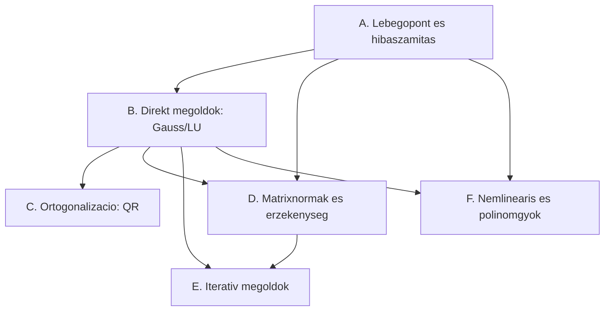
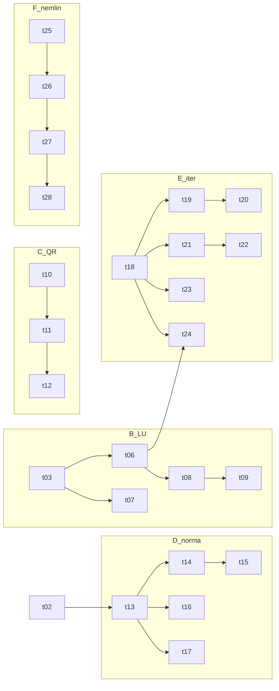

# NM1 szóbeli tételek – kategorizálás és kapcsolatháló

Forrás: `Wiki/concepts/nummodi/tetelek/` (28 tétel). Munkadátum: 2026-06-09.

## Szintézisek (tanuláshoz, közös szál mentén)

A 28 tétel **4 közös vázra** épül. Tanuld a vázat, a tételek = a váz változatai (delták). Minden fájl: közös váz egyszer → tétel-delták táblázat → felmondható tételmondatok → bizonyítás-magok.

| Szintézis | Tételek | Közös szál |
|-----------|---------|-----------|
| [[S1-hiba-es-erzekenyseg]] | 01,02,13,14,15,16,17 | relatív hiba erősítése: kerekítés→norma→kondíció ($\kappa$); a katasztrofális törlés = a rossz kondíció ugyanaz |
| [[S2-direkt-faktorizaciok]] | 03–12 | $A$ = szorzat → helyettesítés; háromszög (LU-család) vs ortogonális (QR) ág; műveletigény-skála |
| [[S3-iterativ-hasitasok]] | 18–24 | egy sablon $x_{k+1}=x_k+P^{-1}r_k$, a $P$ választása minden; konvergencia $\varrho(B)<1$ |
| [[S4-nemlinearis]] | 25–28 | fixpont + linearizálás; konvergenciarend $p$ közös skála (felezés 1, szelő 1,618, Newton 2) |

> Megjegyzés: ez a 4-es bontás finomítja az alábbi 6 kategóriát — a hiba (01-02) és a mérőszámok (13-17) egy közös szál (relatív hiba → kondíció), ezért S1-ben egyesítve.

---

## Eredeti 6 kategória (referencia)

## Kategóriák

### A. Lebegőpont és hibaszámítás
- tétel-01 – Lebegőpontos számábrázolás
- tétel-02 – Hibaszámítás (abszolút/relatív hiba, kondíció)

### B. Direkt megoldók – Gauss-elimináció és LU-család
- tétel-03 – Gauss-elimináció
- tétel-04 – LU-kapcsolat 1
- tétel-05 – LU-kapcsolat 2
- tétel-06 – LU direkt előállítás
- tétel-07 – Schur-komplementer (blokk-GE)
- tétel-08 – LDU-felbontás
- tétel-09 – Cholesky-felbontás (SPD)

### C. Ortogonalizáció – QR
- tétel-10 – QR / Gram–Schmidt
- tétel-11 – Householder 1
- tétel-12 – Householder 2

### D. Mátrixnormák és érzékenység (kondíció)
- tétel-13 – Mátrixnormák 1
- tétel-14 – Mátrixnormák 2
- tétel-15 – Frobenius-norma
- tétel-16 – LER érzékenysége: jobboldal perturbáció
- tétel-17 – LER érzékenysége: mátrix perturbáció

### E. Iteratív megoldók
- tétel-18 – Iterációs konvergencia (hasítás, kontrakció, $\varrho(B)<1$)
- tétel-19 – Jacobi-iteráció
- tétel-20 – Csillapított Jacobi
- tétel-21 – Gauss–Seidel
- tétel-22 – Gauss–Seidel relaxáció (SOR)
- tétel-23 – Richardson-iteráció
- tétel-24 – Részleges LU / ILU (prekondicionáló)

### F. Nemlineáris egyenletek és polinomgyökök
- tétel-25 – Nemlineáris 1
- tétel-26 – Nemlineáris 2
- tétel-27 – Nemlineáris 3
- tétel-28 – Polinomgyök-becslés

## Kategória-kapcsolatháló

### Kapcsolatok indoklása
- A → B: hibaszámítás alapozza a GE/LU stabilitását.
- A → D: hibafogalom → kondíciószám, normák.
- B → C: GE/LU után ortogonális (QR) faktorizáció mint alternatíva.
- B → D: LU pontossága a mátrix kondíciójától függ.
- B → E: ILU (24) a direkt felbontás hiányos változata, iteratív prekondicionáló.
- D → E: spektrálsugár/norma adja iterációk konvergenciafeltételét ($\|B\|<1$, $\varrho(B)<1$).
- A → F, B → F: Newton-típus + lineáris lépések a nemlineáris megoldókban.

## Tétel-szintű kapcsolatháló (kategórián belül)

