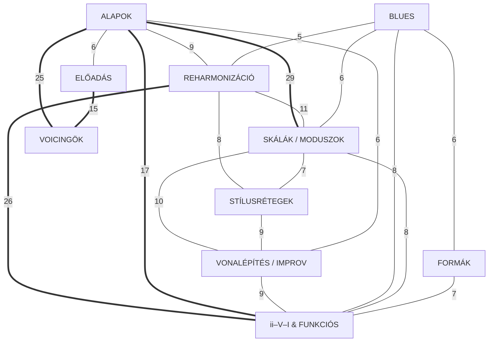

---
tags:
  - subject
sources: []
derivation: unsourced
updated: 2026-09-21
---

# Jazzelmélet

A jazz harmónia- és improvizációelmélete zongorás nézőpontból, a Berklee/Levine-féle **chord-scale** keretrendszerben. Nem egyetemi tárgy, hanem önálló érdeklődési terület — és az egyetlen tárgy a wikiben, amelynek lapjai **forrás nélkül** készülnek.

## A keretrendszerről

A jazzelmélet leíró hagyomány: ugyanazt a zenét több, egymással nem kompatibilis szótár írja le. Ezek a lapok következetesen a **chord-scale theory**-t használják (minden akkordhoz skála tartozik, avoid note-okkal és available tension-ökkel) — ez a legelterjedtebb közös nyelv, és ehhez illeszkedik a legtöbb elérhető irodalom. Ahol egy másik iskola (Barry Harris sixth-diminished megközelítése, Russell Lydian Chromatic Concept-je, vagy a klasszikus funkciós analízis) érdemben mást mondana, azt a fogalomlap külön jelzi — de nem keverjük a szótárakat egy leíráson belül.

A gyakorlati oldal (voicingok, comping, kéz-felosztás) **zongorára** van hangolva.

## Témakörök

62 fogalomlap hét témakörben, mind a `concepts/jazz/` mappában.

**Belépési pontok:** a [[concepts/jazz/chord-scale-theory|chord-scale-theory]] az egész anyag gerince (a legtöbb lap ide hivatkozik vissza); a [[concepts/jazz/ii-v-i-durban|ii-v-i-durban]] a funkciós harmónia kiindulása; a [[concepts/jazz/harmoniai-nyelvek-osszevetese|harmoniai-nyelvek-osszevetese]] pedig felülnézetből köti össze a témaköröket.

### Akkordok és skálák

- [[concepts/jazz/akkordepites]] — hármashangzat → seventh chord; akkordtípusok tercépítkezésből, akkordszimbólum-olvasás
- [[concepts/jazz/extensions]] — 9, 11, 13 mint a tercépítkezés folytatása; a 11 problémája dúr akkordon
- [[concepts/jazz/alteraciok]] — b9, ♯9, ♯11, b13; melyik akkordtípuson mi elérhető; az altered dominant összképe
- [[concepts/jazz/sus-es-phrygian-akkordok]] — sus és phrygian akkord; a negyed mint tercpótlás, és a II–V egyetlen akkordra vonása
- [[concepts/jazz/chord-scale-theory]] — a témakör gerince: akkord → skála levezetés, available tension vs avoid note, a fél hang szabály
- [[concepts/jazz/dur-skala-modusai]] — a hét módus, intervallumszerkezet, characteristic note, akkordmegfeleltetés
- [[concepts/jazz/melodic-minor-modusai]] — altered (super locrian), lydian dominant, locrian ♮2 és a többi módus
- [[concepts/jazz/harmonic-minor-modusai]] — a módusok, hangsúllyal a phrygian dominant-on és a moll ii–V dominánsán
- [[concepts/jazz/harmonic-major-modusai]] — mikor kerül elő; a mixolydian b2 mint a lap gerince
- [[concepts/jazz/szimmetrikus-skalak]] — diminished (half-whole, whole-half) és whole tone; transzpozíciós szimmetria
- [[concepts/jazz/blues-scale]] — felépítés, viszony a moll pentatonhoz, blue note-ok, korlátok
- [[concepts/jazz/bebop-skalak]] — a kromatikus átmenőhang logikája és metrikus következménye
- [[concepts/jazz/negyhangu-skalak]] — négyhangú részhalmazok; a minor sixth scale
- [[concepts/jazz/pentaton-skalak]] — kvintekből épülő, félhang nélküli skála; öt módus; miért nincs avoid note
- [[concepts/jazz/modositott-pentatonok]] — moll 6, moll b5, dúr b6 és domináns pentaton; szülőskálák
- [[concepts/jazz/pentaton-akkordhozzarendeles]] — melyik alaphangú pentaton melyik akkordra; ii–V–I lánc

### Funkciós harmónia

- [[concepts/jazz/ii-v-i-durban]] — a jazz alapkadenciája: funkciók, guide tone-mozgás, chord-scale-ek, variánsok
- [[concepts/jazz/ii-v-i-mollban]] — iim7b5 – V7alt – im(maj7); miért más a skálakészlet
- [[concepts/jazz/secondary-dominant]] — V7/x, feloldás, skálaválasztás, a related ii
- [[concepts/jazz/extended-dominant]] — dominánsláncok a kvintkörön
- [[concepts/jazz/tritone-substitution]] — a közös tritonusz, subV7, kromatikus basszus, lydian dominant
- [[concepts/jazz/backdoor-ii-v]] — iv7 – bVII7 – Imaj7; honnan jön és miért oldódik
- [[concepts/jazz/modal-interchange]] — kölcsönzött akkordok a párhuzamos hangnemekből
- [[concepts/jazz/diminished-passing-chords]] — kromatikus átmenő dim7-ek; a dim7 mint dominánshelyettes
- [[concepts/jazz/turnaround]] — visszavezetés a forma elejére; I–vi–ii–V és kromatikus variánsai
- [[concepts/jazz/coltrane-changes]] — a nagyterc-ciklus mint szimmetrikus elv
- [[concepts/jazz/funkciocsoportok]] — tonika/szubdomináns/domináns csoportok; diatonikus helyettesítés és korlátai
- [[concepts/jazz/reharmonizacio]] — a témakör gyűjtőlapja: a technikák rendszerezése

### Voicingok (zongora)

- [[concepts/jazz/guide-tone]] — a 3 és 7 mint minőséghordozó; szerepcsere ii–V–I-ben
- [[concepts/jazz/shell-voicing]] — alaphang + 3 és 7; a legegyszerűbb működő kíséret
- [[concepts/jazz/rootless-voicing]] — A és B forma akkordtípusonként; váltás minimális mozgással
- [[concepts/jazz/drop-2-drop-3]] — a close position szétnyitása; kombináció a két kéz között
- [[concepts/jazz/block-chord]] — locked hands; négyszólamú zárt harmonizálás, Shearing- és Garland-változatok
- [[concepts/jazz/stride-es-bud-powell-voicing]] — a stride bal kéz és az azt felváltó csontvázas bebop-alak
- [[concepts/jazz/kvartalis-voicing]] — kvartokból épített rakások; a So What voicing; modális kontextus
- [[concepts/jazz/upper-structure-triad]] — felső triád a domináns váza fölött; tension-kombinációk
- [[concepts/jazz/szolamvezetes]] — közös hang, legkisebb mozgás, ellenmozgás, felső szólam mint dallam
- [[concepts/jazz/comping]] — ritmikai szerep, sűrűség és tér, kézfelosztás előadói helyzetenként
- [[concepts/jazz/voicing-stilusonkent]] — melyik voicing melyik ritmikai karakterben: swing, ballada, bossa, latin, keringő, funk

### Formák

- [[concepts/jazz/blues-forma]] — a 12 ütemes alapforma; miért nem funkciós dominánsok
- [[concepts/jazz/jazz-blues]] — a szokásos jazz-változat; melyik hozzáadás mit old meg
- [[concepts/jazz/bird-blues]] — a bebop-reharmonizált séma; összevetés a jazz blues-zal
- [[concepts/jazz/moll-blues]] — a moll 12 ütem; a 9–10. ütem megoldásai
- [[concepts/jazz/rhythm-changes]] — az AABA 32 ütem; a bridge dominánslánca; miért gyakorlóforma
- [[concepts/jazz/aaba-abac]] — a két leggyakoribb song form; kadenciapontok, tájékozódás
- [[concepts/jazz/modalis-forma]] — lassú harmóniai ritmus, pedálhang, a funkciós vonzás hiánya

### Improvizáció

- [[concepts/jazz/guide-tone-line]] — a 3-ak és 7-ek mint melodikus váz; a legerősebb kiindulás
- [[concepts/jazz/enclosure]] — a célhang körbejárása; minták és metrikai elhelyezés
- [[concepts/jazz/approach-note]] — egyszeres megközelítő hangok; viszony az enclosure-höz
- [[concepts/jazz/digital-pattern]] — számmintázatok és szekvenciálásuk; a mechanikusság elkerülése
- [[concepts/jazz/side-slipping]] — fél hanggal elcsúsztatott anyag mint feszültség
- [[concepts/jazz/szuperimponalas]] — rávetített triádok és ii–V-k; irányított inside–outside–resolution
- [[concepts/jazz/pentaton-cellak]] — négyhangos pentaton-részhalmazok, permutációk, cellaláncok
- [[concepts/jazz/pentaton-outside]] — pentaton eltolása; a kvintkör mint távolságskála
- [[concepts/jazz/ritmikus-eltolas]] — eltolt motívumismétlés; három a négy ellen; formakövetés

### Stílusrétegek

- [[concepts/jazz/bebop-harmonia]] — sűrű harmóniai ritmus és a belőle következő dallami nyelv
- [[concepts/jazz/modalis-jazz-harmonia]] — a funkciós vonzás felfüggesztése; miért kvartális a voicing
- [[concepts/jazz/post-bop-harmonia]] — lebegő tonalitás, nem funkciós kapcsolatok, hibrid akkordok
- [[concepts/jazz/salsa-latin-montuno]] — a montuno mint kötött ostinato; clave, tumbao, és miért nem comping
- [[concepts/jazz/harmoniai-nyelvek-osszevetese]] — a három nyelv összevetése; hidak a többi témakörhöz

### Gyakorlás

- [[concepts/jazz/skalagyakorlas]] — a root-bias problémája; belépési pontok és szekvenciálás
- [[concepts/jazz/gyakorlasi-modszertan]] — általános gyakorlási elvek, transzkripció, technika

<!-- gen_hub_graph: topic graph — GENERATED, do not edit by hand -->

<!-- gen_hub_graph: page graph -->

<!-- /gen_hub_graph -->

```mermaid
graph TD
  subgraph Alapok["ALAPOK"]
    n1["akkordepites.md"]
    n2["alteraciok.md"]
    n11["chord-scale-theory.md"]
    n20["extensions.md"]
    n21["funkciocsoportok.md"]
    n22["guide-tone.md"]
    n54["sus-es-phrygian-akkordok.md"]
    n56["szolamvezetes.md"]
  end
  subgraph Skalak["SKÁLÁK / MODUSZOK"]
    n6["bebop-skalak.md"]
    n10["blues-scale.md"]
    n17["dur-skala-modusai.md"]
    n26["harmonic-major-modusai.md"]
    n27["harmonic-minor-modusai.md"]
    n32["melodic-minor-modusai.md"]
    n36["modositott-pentatonok.md"]
    n38["negyhangu-skalak.md"]
    n39["pentaton-akkordhozzarendeles.md"]
    n42["pentaton-skalak.md"]
    n55["szimmetrikus-skalak.md"]
  end
  subgraph Voicing["VOICINGÖK"]
    n8["block-chord.md"]
    n16["drop-2-drop-3.md"]
    n31["kvartalis-voicing.md"]
    n47["rootless-voicing.md"]
    n50["shell-voicing.md"]
    n53["stride-es-bud-powell-voicing.md"]
    n60["upper-structure-triad.md"]
  end
  subgraph iiVI["ii–V–I & FUNKCIÓS"]
    n4["backdoor-ii-v.md"]
    n19["extended-dominant.md"]
    n23["guide-tone-line.md"]
    n28["ii-v-i-durban.md"]
    n29["ii-v-i-mollban.md"]
    n49["secondary-dominant.md"]
    n59["turnaround.md"]
  end
  subgraph Reharm["REHARMONIZÁCIÓ"]
    n12["coltrane-changes.md"]
    n15["diminished-passing-chords.md"]
    n33["modal-interchange.md"]
    n44["reharmonizacio.md"]
    n58["tritone-substitution.md"]
  end
  subgraph Blues["BLUES"]
    n7["bird-blues.md"]
    n9["blues-forma.md"]
    n30["jazz-blues.md"]
    n37["moll-blues.md"]
  end
  subgraph Stilus["STÍLUSRÉTEGEK"]
    n5["bebop-harmonia.md"]
    n25["harmoniai-nyelvek-osszevetese.md"]
    n35["modalis-jazz-harmonia.md"]
    n43["post-bop-harmonia.md"]
  end
  subgraph Forma["FORMÁK"]
    n0["aaba-abac.md"]
    n34["modalis-forma.md"]
    n45["rhythm-changes.md"]
  end
  subgraph Vonal["VONALÉPÍTÉS / IMPROV"]
    n3["approach-note.md"]
    n14["digital-pattern.md"]
    n18["enclosure.md"]
    n40["pentaton-cellak.md"]
    n41["pentaton-outside.md"]
    n46["ritmikus-eltolas.md"]
    n51["side-slipping.md"]
    n57["szuperimponalas.md"]
  end
  subgraph Eloadas["ELŐADÁS"]
    n13["comping.md"]
    n24["gyakorlasi-modszertan.md"]
    n48["salsa-latin-montuno.md"]
    n52["skalagyakorlas.md"]
    n61["voicing-stilusonkent.md"]
  end
  n0 --- n9
  n0 --- n34
  n0 --- n45
  n1 --- n11
  n1 --- n20
  n2 --- n11
  n2 --- n20
  n2 --- n32
  n2 --- n55
  n2 --- n58
  n2 --- n60
  n3 --- n14
  n3 --- n18
  n3 --- n23
  n4 --- n33
  n4 --- n44
  n5 --- n6
  n5 --- n25
  n5 --- n35
  n5 --- n43
  n6 --- n10
  n6 --- n11
  n7 --- n9
  n7 --- n30
  n8 --- n16
  n8 --- n53
  n8 --- n56
  n9 --- n10
  n9 --- n30
  n9 --- n37
  n9 --- n45
  n9 --- n59
  n10 --- n37
  n10 --- n42
  n11 --- n17
  n11 --- n20
  n11 --- n27
  n11 --- n28
  n11 --- n32
  n11 --- n39
  n11 --- n55
  n12 --- n19
  n12 --- n43
  n12 --- n44
  n13 --- n31
  n13 --- n46
  n13 --- n47
  n13 --- n48
  n13 --- n50
  n13 --- n56
  n13 --- n61
  n14 --- n18
  n14 --- n40
  n14 --- n46
  n15 --- n30
  n15 --- n44
  n15 --- n55
  n15 --- n59
  n16 --- n31
  n16 --- n47
  n16 --- n56
  n17 --- n20
  n17 --- n27
  n17 --- n32
  n17 --- n33
  n17 --- n35
  n18 --- n23
  n19 --- n45
  n19 --- n49
  n19 --- n58
  n19 --- n59
  n20 --- n47
  n21 --- n28
  n21 --- n33
  n21 --- n59
  n22 --- n23
  n22 --- n47
  n22 --- n50
  n22 --- n56
  n24 --- n52
  n25 --- n35
  n25 --- n43
  n26 --- n27
  n26 --- n55
  n27 --- n29
  n27 --- n32
  n28 --- n29
  n28 --- n50
  n28 --- n58
  n28 --- n59
  n29 --- n32
  n29 --- n33
  n29 --- n37
  n30 --- n37
  n31 --- n34
  n31 --- n35
  n31 --- n42
  n31 --- n54
  n32 --- n58
  n33 --- n43
  n33 --- n44
  n34 --- n35
  n34 --- n37
  n35 --- n43
  n35 --- n51
  n36 --- n39
  n36 --- n42
  n39 --- n40
  n39 --- n42
  n40 --- n41
  n40 --- n42
  n41 --- n42
  n41 --- n57
  n44 --- n49
  n44 --- n58
  n44 --- n59
  n45 --- n59
  n46 --- n51
  n47 --- n50
  n49 --- n58
  n51 --- n57
  n53 --- n56
  n53 --- n61
  n57 --- n60
  n58 --- n59
```

## Kapocs

Ez a tárgy önálló, nem kapcsolódik a wiki egyetemi anyagához.
